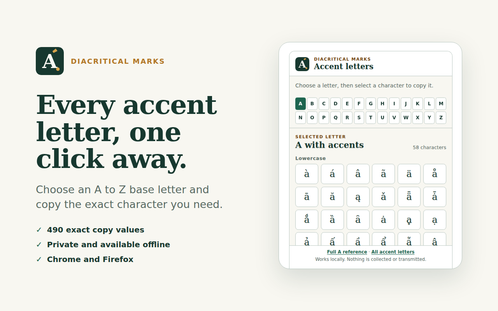

# Accent Letters: Copy & Paste

[](https://github.com/digitalbayer/accent-letters-copy/actions/workflows/validate.yml)

A compact Manifest V3 browser extension for copying accented Latin letters from the toolbar. It uses one shared interface and produces separate Chrome and Firefox packages.



## Features

* 488 precomposed Latin characters organized by A to Z base letter
* Two disclosed Q plus combining acute sequences
* Exact one-click copying with accessible feedback
* Keyboard navigation and enlarged-text support
* No accounts, analytics, advertisements or runtime network requests
* No clipboard reading and no requested browser permissions

## Privacy

Everything runs locally in the extension popup. The extension writes a character to the clipboard only after the user selects that character. It does not read the clipboard or collect, store or transmit data.

## Development

Requires Node.js 22 or later and `zip`.

```sh
npm install
npm run generate
npm run validate
```

`npm run validate` runs the complete inventory, package, accessibility and Chromium checks. Run `npx playwright install firefox` once and `npm run test:firefox` for the same popup suite in Firefox.

Generated packages:

* `dist/chrome/accent-letters-copy-1.0.0.zip`
* `dist/firefox/accent-letters-copy-1.0.0.zip`

## Local installation

### Chrome

1. Run `npm run build`.
2. Open `chrome://extensions`.
3. Enable Developer mode.
4. Choose Load unpacked and select `build/chrome`.

### Firefox

1. Run `npm run build`.
2. Open `about:debugging#/runtime/this-firefox`.
3. Choose Load Temporary Add-on.
4. Select `build/firefox/manifest.json`.

## Data provenance

The inventory is deterministically generated from a pinned subset of UnicodeData 17.0.0. The subset contains every qualifying record and each row required to resolve its canonical decomposition. It includes Latin letter records whose recursive canonical decomposition consists of an ASCII A to Z base followed only by combining marks. The compatibility Angstrom sign is excluded. Q has no qualifying precomposed character, so its two visible entries are explicitly stored combining sequences.

Regenerate the inventory with `npm run generate`. `npm run generate:check` confirms that committed output matches the pinned data. To reproduce the compact source subset from the official full file, run `npm run unicode:subset -- /path/to/UnicodeData.txt`.

## Complete reference

Visit [DiacriticalMarks.com](https://diacriticalmarks.com/accent-letters/) for character details, Unicode references, language guides and text tools.

## License

The extension source is available under the MIT License. The pinned Unicode data has its own terms in `vendor/UNICODE-LICENSE.txt`.
